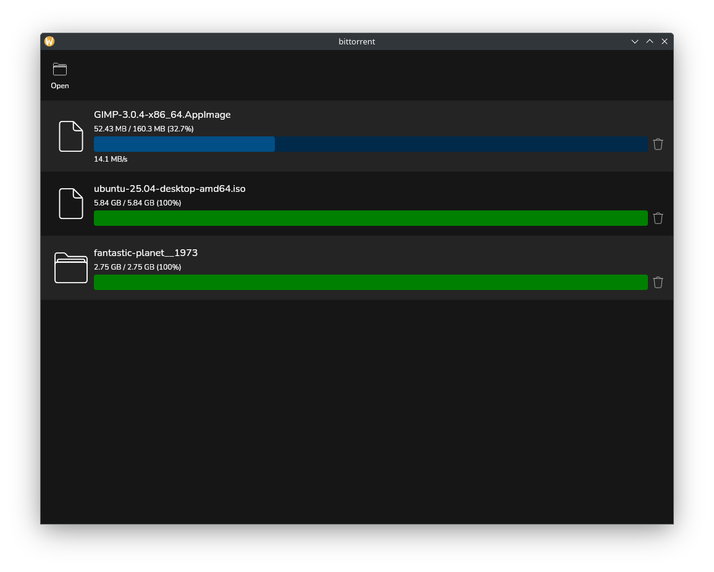

# gBittorrent
gBittorrent is a desktop BitTorrent client written in Go and React.

## What is BitTorrent?
BitTorrent is a peer to peer file sharing protocol that enables efficient, decentralized distribution of data. Instead of relying on a single source, users can get "pieces" from multiple peers, significantly speeding up the download process. For more information, see: https://wiki.theory.org/BitTorrentSpecification 
## How does gBittorrent work?
gBittorrent utilizes Go's concurrency features to simulatenously retrieve data from multiple peers. This allows for efficient and quick file downloads.
